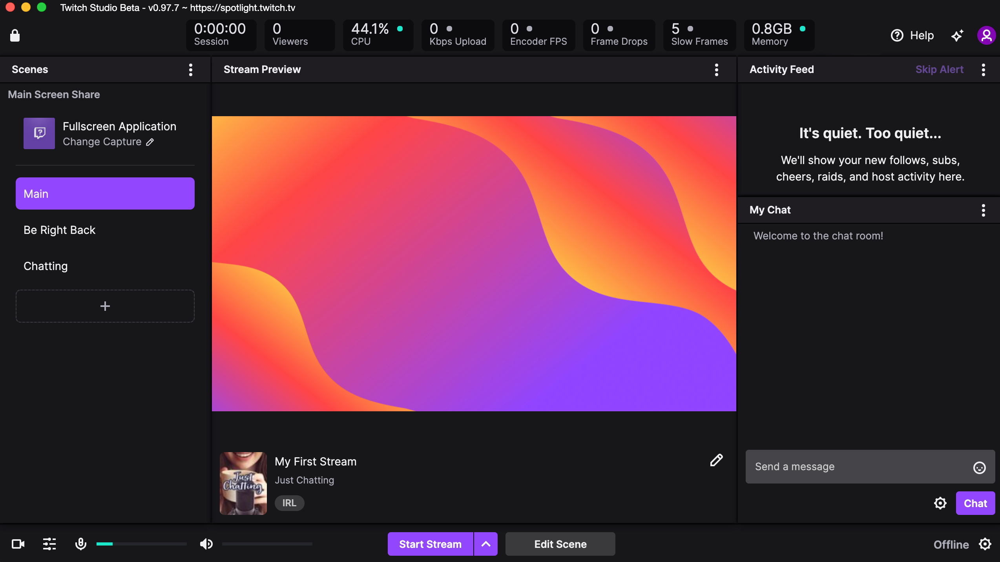

<!-- # How to set up your live stream with Twitch Studio  -->

## Before you start

If you haven't installed Twitch Studio, see [Installing Twitch Studio](/jekyll/twitchstudio/2021/02/27/Tutorial_Getting_Started.html). When you reach the app's main screen, proceed with the tutorial.

<!-- 

 -->

## Step 1. Capture gameplay
Open the game you want to stream. Return to the app and locate the Scenes panel. Under Main Screen Share, click **Change Capture**. 

<!-- 

 -->

In the new dialog, select your game window from the list of applications. Click **Next**.

<!-- 

 -->

<!-- ## Preview your stream
Click on a scene to view it in the Stream Preview window. Ensure alerts, media, transitions, and other features look how you intended.  -->

## Step 2. Add a title 
Give your stream a title, category, and one or more tags. You can also specify the stream language. 

<!-- Add more details to make your content searchable.  -->
>#### Note: Complete and accurate stream info helps make your content discoverable.

<!-- 

 -->

Click **Done**.

<!-- >#### Note: Take one last moment to consult the Stream Preview window. What you see here is exactly how your stream will look to viewers.  -->

## Step 3. Customize scenes
Select a scene from the Scenes panel to display it in the Stream Preview window.

 <!-- As you make changes, consult the Stream Preview window to make sure everything looks the way you intended.  -->

<!-- 

 -->

If you want to make changes to the selected scene, click **Edit Scene**. 

<!-- Your screen will immediately switch to Editor mode, displaying an enlarged preview window and layers list for the selected scene. -->

In the editor, you can fully customize your scenes. Some functionality includes:

- Accessing Twitch Studio's media library of images, patterns, and wallpapers. 

- Changing position, color, and content of text and screen captures.

- Adding alerts and deciding how they show up in your stream. 

<!-- See Customizing scenes for a complete tutorial on editing and creating new scenes. -->

When you're done making changes, click **Save** to return home.

<!-- 

 -->

<!-- Continue customizing scenes until you're happy with how everything looks. -->

>#### Note: What you see in the Stream Preview window is exactly what your viewers see when you go live. Take a minute to review your scenes and make sure everything looks good.

<!-- Your stream will look to viewers exactly as it appears in the Stream Preview window. Take a minute to click through your scenes and make sure everything looks the way you want it to look. -->

## Step 4. Start streaming
You're ready to go live! Click **Start stream**. Monitor and manage your stream at any time from the app. To end your streaming session, click **Stop stream**. 

<!-- 

 -->

<!-- If you want to learn more about Twitch Studio, see our How-Tos:
-Customizing Scenes

And our Reference docs:
-Stats panel
-Notifications and alerts

For further discussion:
-Twitch Studio vs. OBS or XSplit
-Capture cards  -->

