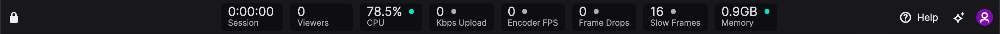
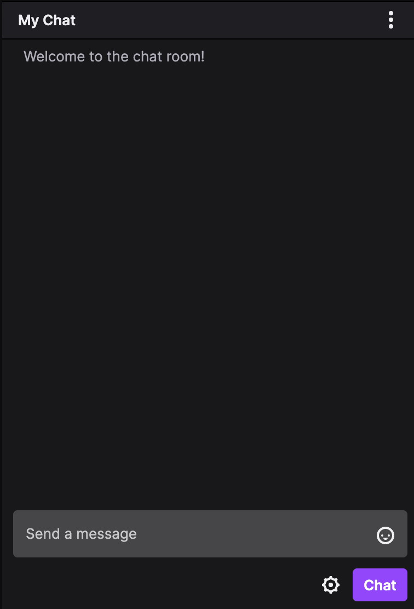

<!-- Stats panel: Monitor stream performance in real-time. 
Activity feed: Toggle notifications and alerts (reference doc for feed and alert terms?) 
Interact with chat: Read and send messages to your audience. Enable moderation actions in chat settings.
Click a scene to view it in the Stream Preview window. Switch between scenes to preview transitions.
Quick buttons: Click to toggle webcam and audio on/off. Use sliders to Adjust mic and speaker volumes or click to mute/unmute.
Make your content searchable: Add a title, category, and one or more tags to your video.  -->

## Scenes sidebar

With Twitch Studio, you can customize and create new scenes. 

<!-- Scenes are visual themes to display throughout your stream. You'll notice that you have a Main, Just Chatting, and Be Right Back scene to start. The Main scene, for instance, might include a webcam capture, your game screen, and an alerts banner. If you need to take a break but don't want to stop streaming, customize the Be Right Back scene to pop on screen while you're away.  -->

In the Scenes sidebar, see a list of your scenes. Right click a scene name to delete, duplicate, edit, or rename it. Click the plus icon at the bottom to add a new scene.

To share a game screen, select the Main scene and click Change Capture.

> Note: To add screen capture to a scene, it must have a Screen Share layer. 

## Stats Panel
Notice the stats panel at the top of the screen. These metrics will help you monitor your stream quality in real time. Check your frame rate, upload speed, and % demand on your CPU. You can also see how many viewers are tuning in to your stream and the duration of your streaming session. Click the padlock icon to remove stats from the panel or drag and drop them in any order. 

To the right of the stats bar, you'll see a series of buttons. Use the Help button to report a bug, request a new feature, consult the FAQs, or even join the Twitch Studio Discord server to discuss all things Twitch Studio. 

Click the Stars button to open the Twitch Studio news feed, where relevant articles and tutorials are posted.

Click your avatar to interact with your Twitch account. You can open your Twitch dashboard, which you'll notice looks quite similar to the Twitch Studio interface. If you prefer sharing recorded content to live streaming, click Video Producer. Here, you can upload videos to your Twitch channel.

<!-- 
Avatar: 
    Dashboard: open your Twitch dashboard/stream manager
    Channel page: Opens your Twitch channel home page i.e. twitch.tv/yourusername
    Video producer: open Video Producer tab in Twitch (under Content) >> allows you to upload recorded video. (alternative to live streaming) -->

## Activity Feed 
<!-- Notifications and alerts show up in your Activity Feed; examples include new subs, follows, gifted subs, bits, and other actions that viewers can take to support your channel. -->

When viewers take a new action to support your channel, you'll receive a notification or alert in your Activity Feed. Examples of these actions include subs, follows, gifted subs, bits, hosts, and raids. 

The difference between notifications and alerts is that notifications only show up in your Activity Feed, whereas alerts can display both in your Activity Feed and on your stream. 

Click the 3 dots icon to toggle feed notifications and alerts on or off. 

> Note: To share alerts on a scene, it must have a Twitch Alerts layer.

## Chat
Interact with your audience! In the chat window, you have the ability to read and send messages to your viewers in real time. Click the cogwheel to open chat settings and enable moderation actions-- like emotes-only chat 😮😮😮 or followers-only chat.

## Stream Preview
Before you start streaming, check out your scenes and customizations in the Stream Preview window. You can also use Stream Preview while streaming to make sure your viewers are seeing everything you want them to see. 

## Stream info
Click the pencil icon to add or edit the title, category, and tags for your stream. 

## Audio/Video Controls
Toggle your webcam on and off with a single click. Use the slider tool to adjust the volume on each audio device. You can also click the mic or speaker icon to mute the device.

## General settings
Click the cogwheel to open the General Settings menu. Here, you can add transitions, add or swap an audio device, adjust stream quality settings, and customize hotkeys.

Now that you're familiar with the Twitch Studio user interface, why not try some tutorials? 

[How to set up a livestream using Twitch Studio](/jekyll/twitchstudio/2021/02/27/How_to_set_up_livestream.html)